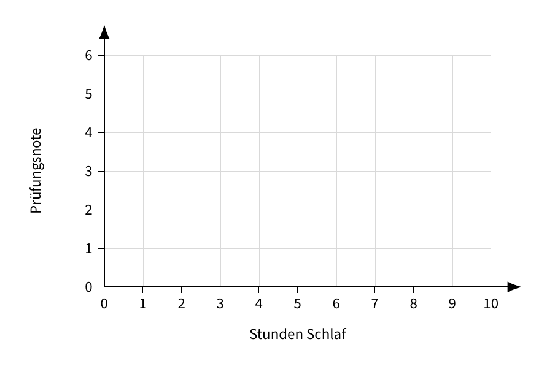
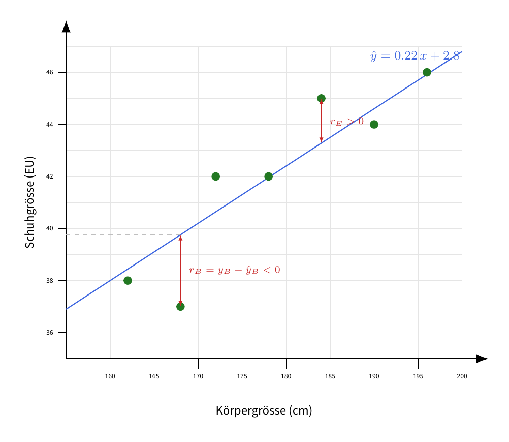
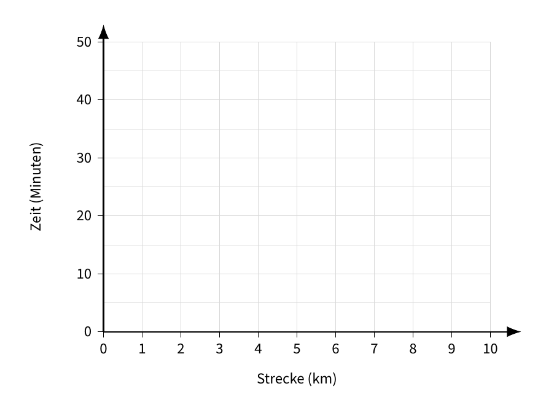

# Lineare Regression

## Vorhersagen mit Linien

Wir betrachten Beobachtungen der Form $x \rightarrow y$ (Eingabe $\rightarrow$ Ausgabe).

Wir suchen eine Funktion, die $y$ *schätzt*:

$$\hat{y} = f(x)$$

::: {.callout-tip icon=false}
## Aufgabe 1 — Daten sammeln

Überlege für das Beispiel **«Stunden schlafen → Prüfungsnote»**: Schreibe für jede Stundenzahl auf der $x$-Achse eine Schätzung für die erwartete Prüfungsnote auf und trage die Punkte im Koordinatensystem ein.

$$
(0,\ \underline{\hspace{1cm}}),\quad
(4,\ \underline{\hspace{1cm}}),\quad
(6,\ \underline{\hspace{1cm}}),\quad
(7,\ \underline{\hspace{1cm}}),\quad
(8,\ \underline{\hspace{1cm}}),\quad
(9,\ \underline{\hspace{1cm}}),\quad
$$

{width=100%}
:::

## Die Linie

Eine **lineare Funktion** hat die Form

$$\hat{y} = \underline{\hspace{2cm}} \cdot x + \underline{\hspace{2cm}}$$

Bezeichne die zwei Teile:

- **Steigung**: $m =$ \_\_\_\_\_\_\_\_\_\_\_\_\_\_\_\_\_\_\_\_\_\_\_\_\_\_
- \_\_\_\_\_\_\_\_\_\_\_\_: \_\_\_\_\_ $=$ Wert von $\hat{y}$ bei $x =$ \_\_\_\_

::: {.callout-tip icon=false}
## Aufgabe 2 — Beste Linie schätzen

Was ist ungefähr die beste Linie, um die Punkte aus Aufgabe 1 zu beschreiben? Schreibe die Gleichung auf:

$$\hat{y} = \underline{\hspace{2cm}} \cdot x + \underline{\hspace{2cm}}$$

Würde die Linie immer noch gut passen, wenn wir noch mehr Punkte von vielen anderen Personen hätten?
:::

::: {.callout-tip icon=false}
## Aufgabe 3 — Bedeutung der Linie

Stell dir vor, wir hätten die Daten (Schlafdauer, Prüfungsnote) von allen Schülerinnen und Schülern der Kantonsschule Kreuzlingen gesammelt und daraus die «beste» Linie gefunden.

a) Welche praktische Bedeutung hat der Wert bei $x = 0$?
b) Werden die meisten Punkte genau auf der Linie liegen?
c) Für wen könnte eine solche Linie nützlich sein und zu welchem Zweck?
:::

## Wie messen wir «gut»?

Angenommen, wir haben eine Linie $f(x) = mx + b$ gewählt. Wir bezeichnen die Vorhersage für einen Punkt $x$ mit $\hat{y} = f(x)$.

Für einen Datenpunkt $(x, y)$ und eine Vorhersage $\hat{y}$ definieren wir den **Fehler** (Residuum):

$$r = y - \hat{y}$$

*Beispiel:* Für $x = 4$ sagt eine Linie $\hat{y} = 7$, das echte $y$ ist $8$.
$$r = 8 - 7 = 1$$

Das folgende Bild zeigt einen Scatter-Plot mit einer Regressionslinie und zwei eingezeichneten Residuen:

{width=100%}

### Mean Squared Error (MSE)

So bestimmst du den MSE für $n$ Punkte Schritt für Schritt:

1. Für jeden Punkt $i = 1, 2, \dots, n$: berechne die Vorhersage $\hat{y}_i$ mit deiner Linie.
2. Berechne den Fehler (Residuum) $r_i = y_i - \hat{y}_i$.
3. Quadriere den Fehler: $r_i^2$.
4. Bilde den Durchschnitt der quadrierten Fehler:

$$
\text{MSE}
= \frac{r_1^2 + r_2^2 + \dots + r_n^2}{n}
= \frac{1}{n} \sum_{i=1}^{n} r_i^2
= \frac{1}{n} \sum_{i=1}^{n} (y_i - \hat{y}_i)^2
$$

**Warum wird quadriert?**

&nbsp;

&nbsp;

Ziel: Finde die Linie mit dem \_\_\_\_\_\_\_\_\_\_ MSE.

::: {.callout-tip icon=false}
## Aufgabe 4 — MSE von Hand berechnen

Die folgenden Daten stammen von 10 Messungen für die **Fahrzeit** ($y$, in Minuten) in Abhängigkeit von der **Strecke** ($x$, in Kilometern).  
Prüfe den Vorschlag $\hat{y} = 6 + 3x$.  
Trage Vorhersage, Fehler und quadrierten Fehler ein und berechne den MSE.

| $x_i$ | 1.0 | 2.0 | 2.5 | 3.0 | 4.0 | 5.5 | 6.0 | 7.5 | 8.0 | 9.5 |
|---|---|---|---|---|---|---|---|---|---|---|
| $y_i$ | 9.2 | 12.3 | 15.2 | 15.9 | 21.0 | 24.8 | 29.0 | 32.9 | 35.7 | 40.2 |
| $\hat{y}_i$ | | | | | | | | | | |
| $r_i = y_i - \hat{y}_i$ | | | | | | | | | | |
| $r_i^2$ | | | | | | | | | | |

Summe $\sum r_i^2 =$ \_\_\_\_\_\_ $\qquad$ Anzahl $n = 10$ $\qquad$ MSE $= \dfrac{1}{n}\sum r_i^2 =$ \_\_\_\_\_\_

Ist das ein guter MSE?
:::

::: {.callout-tip icon=false}
## Aufgabe 5 — MSE in Python berechnen

Zwei weitere Personen haben Linien vorgeschlagen:

- $\hat{y} = 5 + 3.5x$
- $\hat{y} = 4.5 + 4.0x$

Öffne VS Code und berechne die MSEs in Python:

```python
x = [1.0, 2.0, 2.5, 3.0, 4.0, 5.5, 6.0, 7.5, 8.0, 9.5]
y = [9.2, 12.3, 15.2, 15.9, 21.0, 24.8, 29.0, 32.9, 35.7, 40.2]

def get_predictions(m, b):
    y_hat = []

    # TODO: Die Liste y_hat mit den Vorhersagen füllen

    return y_hat

def mse(y, y_hat):
    n = len(y)
    summe = 0

    # TODO: Die Summe der quadrierten Fehler berechnen

    return summe / n

print("MSE für y = 3x + 6:")
print(mse(y, get_predictions(3, 6)))
# TODO: MSE für die zwei anderen Linien hier berechnen und ausgeben
```

Notiere:

$$\text{MSE}_B = \underline{\hspace{3cm}} \qquad \text{MSE}_C = \underline{\hspace{3cm}}$$


::: {.callout-tip icon=false collapse="true"}
## Lösung
```python
x = [1.0, 2.0, 2.5, 3.0, 4.0, 5.5, 6.0, 7.5, 8.0, 9.5]
y = [9.2, 12.3, 15.2, 15.9, 21.0, 24.8, 29.0, 32.9, 35.7, 40.2]

def get_predictions(m, b):
    y_hat = []

    for x_i in x:
        y_hat.append(m * x_i + b)

    return y_hat

def mse(y, y_hat):
    n = len(y)
    summe = 0

    for i in range(n):
        r_i = y[i] - y_hat[i]
        summe += r_i ** 2

    return summe / n

print("MSE für y = 3x + 6:")
print(mse(y, get_predictions(3, 6)))
# TODO: MSE für die zwei anderen Linien hier berechnen und ausgeben
print("MSE für y = 3.5x + 5:")
print(mse(y, get_predictions(3.5, 5)))
print("MSE für y = 4x + 4.5:")
print(mse(y, get_predictions(4, 4.5)))
```

:::

:::

::: {.callout-tip icon=false}
## Aufgabe 6 — Beste Linie mit Python finden

Versuche mithilfe eines Python-Programms die beste Linie zu finden, also eine Gerade $\hat{y} = mx + b$, die den MSE für die obigen Fahrrad-Daten *minimiert*. Starte mit sinnvollen Werten für $m$ und $b$ und verbessere sie.


```python
x = [1.0, 2.0, 2.5, 3.0, 4.0, 5.5, 6.0, 7.5, 8.0, 9.5]
y = [9.2, 12.3, 15.2, 15.9, 21.0, 24.8, 29.0, 32.9, 35.7, 40.2]

def get_predictions(m, b):
    y_hat = []
    # code aus Aufgabe 5 hier einfügen
    return y_hat

def mse(y, y_hat):
    n = len(y)
    summe = 0
    # code aus Aufgabe 5 hier einfügen
    return summe / n

m = 3
b = 6
error = mse(y, get_predictions(m, b))
while True:
    print(f"m = {m}, b = {b}, MSE = {mse(y, get_predictions(m, b))}")
    m_neu = m + 0.1
    # TODO: Neuen MSE berechnen und mit vorherigem vergleichen.
    #       Wenn der neue MSE besser ist, aktualisiere m.

    # TODO: Das gleiche für m in die andere Richtung, sowie für b in beide Richtungen.

    # Hinweis: Mit Ctrl+C kannst du die Endlosschleife jederzeit unterbrechen.

```

Beste gefundene Werte: $m =$ \_\_\_\_\_, $b =$ \_\_\_\_\_ $\quad$ mit MSE $=$ \_\_\_\_\_

Zeichne die gefundene Linie in das folgende Koordinatensystem ein:

{width=100%}

::: {.callout-tip icon=false collapse="true"}
## Lösung
```python
x = [1.0, 2.0, 2.5, 3.0, 4.0, 5.5, 6.0, 7.5, 8.0, 9.5]
y = [9.2, 12.3, 15.2, 15.9, 21.0, 24.8, 29.0, 32.9, 35.7, 40.2]

def get_predictions(m, b):
    y_hat = []
    for x_i in x:
        y_hat.append(m * x_i + b)
    return y_hat

def mse(y, y_hat):
    n = len(y)
    summe = 0
    for i in range(n):
        r_i = y[i] - y_hat[i]
        summe += r_i ** 2
    return summe / n

m = 3
b = 6
schritt = 0.1
error = mse(y, get_predictions(m, b))

while True:
    print(f"m = {m}, b = {b}, MSE = {error}")
    verbessert = False

    # m in beide Richtungen probieren
    for m_neu in [m + schritt, m - schritt]:
        error_neu = mse(y, get_predictions(m_neu, b))
        if error_neu < error:
            m = m_neu
            error = error_neu
            verbessert = True

    # b in beide Richtungen probieren
    for b_neu in [b + schritt, b - schritt]:
        error_neu = mse(y, get_predictions(m, b_neu))
        if error_neu < error:
            b = b_neu
            error = error_neu
            verbessert = True

    # Wenn keine Richtung mehr besser ist: fertig
    if not verbessert:
        break

print(f"Beste Werte: m = {m}, b = {b}, MSE = {error}")
```
:::
:::

# Vom Linienschätzen zu ChatGPT

## Was du gerade gemacht hast

In Aufgabe 6 hast du eine Linie $\hat{y} = m \cdot x + b$ gesucht, die den MSE möglichst klein macht. Dein Vorgehen war:

1. Mit **Startwerten** beginnen ($m = 3$, $b = 6$).
2. Einen Parameter ein bisschen verändern (z. B. $m$ um $0.1$ erhöhen).
3. Schauen, ob der MSE dadurch **kleiner** wird.
4. Wenn ja: Änderung behalten. Wenn nein: andere Richtung probieren.
5. Wiederholen, bis es nicht mehr besser wird.

Dieses Verfahren hat einen Namen: **Gradient Descent** (Gradientenabstieg). Es ist das Herzstück davon, wie *praktisch alle* modernen KI-Modelle lernen — auch ChatGPT.

## Lesen: Wie grosse Modelle «wachsen»

Im Buch *If Anyone Builds It, Everyone Dies* (Yudkowsky & Soares, 2025) beschreibt **Kapitel 2 («Grown, Not Crafted»)**, wie ein grosses Sprachmodell (LLM) trainiert wird.

| Sprache | Download |
| - | - |
| Englisch | [PDF](materials/IABIED_Chap2_excerpt_small.pdf) |
| Deutsch | [PDF](materials/IABIED_Chap2_excerpt_small_de.pdf) |

::: {.callout-note icon=false}
## Leseauftrag (20 Minuten)

Lies den Anfang von Kapitel 2.

Achte beim Lesen auf diese vier Wörter und unterstreiche sie im Text:

- **parameter** / **weights** (die Zahlen im Modell)
- **architecture** (wie Eingabe und Zahlen verrechnet werden)
- **gradient descent** (wie die Zahlen verbessert werden)
- **training data** (woraus gelernt wird)
:::

Die Autoren fassen das Ergebnis so zusammen:

> «An AI is a pile of billions of gradient-descended numbers. Nobody understands *how* those numbers make these AIs talk.»


::: {.callout-tip icon=false}
## Aufgabe 7

Im Buch geht es um Billionen Zahlen. Bei dir waren es **genau zwei**: $m$ und $b$. Das Verfahren ist aber dasselbe. Vervollständige die Tabelle:

| Im Buch (grosses Sprachmodell) | Bei dir (lineare Regression) |
|---|---|
| Eingabe wird in Zahlen umgewandelt | $x$ (z. B. Strecke in km) |
| Billionen **Parameter** (weights), zufällig gestartet | \_\_\_\_\_\_\_\_\_\_\_\_ |
| **Architektur**: hunderte Milliarden Operationen | \_\_\_\_\_\_\_\_\_\_\_\_ |
| Output = Vorhersage des nächsten Buchstabens | \_\_\_\_\_\_\_\_\_\_\_\_ |
| messen, «wie falsch» die Vorhersage ist | \_\_\_\_\_\_\_\_\_\_\_\_ |
| **Gradient Descent**: jedes Gewicht minimal ändern und behalten, wenn es besser wird | \_\_\_\_\_\_\_\_\_\_\_\_ |
| Trillionen Wörter, Monate Rechenzeit, Millionen Dollar | \_\_\_\_\_\_\_\_\_\_\_\_ |
:::

<!-- ::: {.callout-important icon=false}
## Gleiche Idee, andere Grösse

Du hast **2 Zahlen von Hand** optimiert. Ein Sprachmodell optimiert **Billionen** — automatisch, über Monate. Aber der Trick ist identisch: Zahlen leicht verschieben, den Fehler messen, in die bessere Richtung gehen.
:::

::: {.callout-important icon=false}
## «Grown, not crafted» — gezüchtet, nicht gebaut

Bei deiner Linie weisst du **genau**, was die Zahlen bedeuten: $m$ ist die Steigung, $b$ der Achsenabschnitt. Bei Billionen Zahlen weiss das **niemand** mehr. Deshalb sagen die Autoren: Niemand *baut* die Bedeutung in ein grosses Modell hinein — Gradient Descent *stolpert* hinein. Das Modell wird gezüchtet, nicht konstruiert.
::: 

## Leitfragen

1. Warum ist eine Linie mit 2 Parametern leicht zu verstehen, ein Modell mit Billionen Parametern aber nicht?
2. Im Buch heisst es, niemand verstehe, *wie* die Zahlen das Modell zum Sprechen bringen. Bei deiner Linie verstehst du es. Wo genau geht dieses Verständnis verloren, wenn man von 2 auf Billionen Zahlen geht?
3. Du hast in Aufgabe 6 mit Startwerten begonnen und sie verbessert. Was wäre bei deinem Programm das Gegenstück zu den «Trillionen Wörtern Trainingsdaten» aus dem Buch?
-->

# Eigene Daten

Bisher hast du mit vorgegebenen Daten gearbeitet. Jetzt sammelst du **deine eigenen** Daten und findest die beste Linie dafür.

::: {.callout-tip icon=false}
## Aufgabe 8 — Daten sammeln (Lektion 1)

Wählt zu zweit **eines** der folgenden Beispiele oder findet ein eigenes. Sammelt mindestens **10**, idealerweise **20** Datenpunkte $(x, y)$.

| Beispiel | $x$ (Eingabe) | $y$ (Ausgabe) | Wie messen |
|---|---|---|---|
| Glas mit Wasser | Füllstand (cm) | Tonhöhe (Hz) | Glas anschlagen, Frequenz mit einer Ton-/Tuner-App ablesen |
| Sprint | Strecke (m): 10, 20, … | Zeit (s) | Eine Person rennt, eine stoppt |
| Fallen lassen | Höhe (m) | Fallzeit (s) | Objekt aus verschiedenen Höhen fallen lassen, Zeit stoppen |
| Wohnungen | Grösse (m²) | Miete (CHF) | ~20 Inserate auf einem Immo-Portal heraussuchen |
| Gebrauchtwagen | Alter (Jahre) *oder* Kilometerstand | Preis (CHF) | ~20 Inserate auf einem Auto-Portal heraussuchen |
| Lichtquelle / Lautsprecher | Abstand zur Quelle (cm) | Helligkeit (Lux) *oder* Lautstärke (dB) | Mit einer Sensor-App in verschiedenen Abständen messen |

Tragt eure Messwerte direkt als zwei Python-Listen ein:

```python
x = [ ]  # mindestens 10, idealerweise 20 Werte
y = [ ]
```
:::

::: {.callout-tip icon=false}
## Tipp: Fertiger Datensatz (falls ihr keine eigenen Daten habt)

Falls ihr aus Aufgabe 8 keine eigenen Daten habt, könnt ihr stattdessen einen fertigen Datensatz mit **Berufserfahrung** und **Gehalt** verwenden:

[salary_data.csv herunterladen](materials/salary_data.csv)

Speichert die Datei in denselben Ordner wie euer Python-Programm. Die Datei hat eine Kopfzeile und mehrere Spalten:

```
Age,Gender,Education Level,Job Title,Years of Experience,Salary
32,Male,Bachelor's,Software Engineer,5,90000
28,Female,Master's,Data Analyst,3,65000
...
```

Für die lineare Regression interessieren uns nur zwei Spalten:

- $x$ = **Years of Experience** (Berufserfahrung in Jahren)
- $y$ = **Salary** (Gehalt)

So lest ihr die CSV-Datei ein und baut daraus die zwei Listen `x` und `y`:

```python
import csv

x = []  # Berufserfahrung (Jahre)
y = []  # Gehalt

with open("salary_data.csv", encoding="utf-8-sig") as f:
    reader = csv.DictReader(f)
    for zeile in reader:
        erfahrung = zeile["Years of Experience"]
        gehalt = zeile["Salary"]

        # Zeilen mit fehlenden Werten überspringen
        if erfahrung == "" or gehalt == "":
            continue

        x.append(float(erfahrung))
        y.append(float(gehalt))

print(f"{len(x)} Datenpunkte eingelesen")
print("x:", x[:5], "...")
print("y:", y[:5], "...")
```

`csv.DictReader` liest jede Zeile als Wörterbuch ein, sodass ihr die Spalten über ihren Namen (z. B. `zeile["Salary"]`) ansprechen könnt. Mit `float(...)` werden die Texte in Zahlen umgewandelt, damit ihr damit rechnen könnt.

Diese Listen `x` und `y` könnt ihr nun genauso weiterverwenden wie eure eigenen Messwerte — z. B. mit dem Visualisierungs-Code unten oder mit eurem Programm aus Aufgabe 9.
:::

::: {.callout-note icon=false}
## Tipp: Daten visualisieren

Mit folgendem Code könnt ihr eure gesammelten Punkte als Streudiagramm anzeigen:

```python
x = [ ]  # eure Werte aus Aufgabe 8
y = [ ]

import matplotlib.pyplot as plt

plt.scatter(x, y)
plt.xlabel("x")
plt.ylabel("y")
plt.show()
```

Falls `matplotlib` noch nicht installiert ist, im Terminal ausführen:

```bash
pip install matplotlib
```
:::

::: {.callout-tip icon=false}
## Aufgabe 9 — Beste Linie finden (Lektion 2)

Nutzt euren Code aus Aufgabe 5 und 6, um für eure eigenen Daten die beste Gerade $\hat{y} = m \cdot x + b$ zu finden.

1. Ersetzt im Programm die Listen `x` und `y` durch eure Messwerte.
2. Sucht mit Gradient Descent die besten Werte für $m$ und $b$.

Beste gefundene Werte: $m =$ \_\_\_\_\_, $b =$ \_\_\_\_\_ $\quad$ mit MSE $=$ \_\_\_\_\_

Beantwortet anschliessend:

a) Was bedeuten $m$ und $b$ konkret für euer Beispiel (mit Einheit)?
b) Passt eine **Gerade** gut zu euren Punkten, oder wäre eine **Kurve** besser?
c) Was würde eure Linie für einen neuen $x$-Wert vorhersagen, den ihr **nicht** gemessen habt? Ist die Vorhersage glaubwürdig?
:::

::: {.callout-note icon=false collapse="true"}
## Gerade *und* Parabel automatisch fitten

Folgender Code macht mit demselben Verfahren wie in Aufgabe 6 sowohl einen **linearen** als auch einen **quadratischen** Fit auf euren Datensatz und zeichnet beide Kurven. Tragt oben eure eigenen `x`- und `y`-Werte ein.

Diese Pakete müssen vorher im Terminal installiert werden:

```bash
pip install numpy matplotlib seaborn
```

```python
import numpy as np
import matplotlib.pyplot as plt
import seaborn as sns

x = [1.0, 2.0, 2.5, 3.0, 4.0, 5.5, 6.0, 7.5, 8.0, 9.5]
y = [9.2, 12.3, 15.2, 15.9, 21.0, 24.8, 29.0, 32.9, 35.7, 40.2]


def get_predictions(m, b):
    """Vorhersagen fuer eine Gerade: y_hat = m * x + b"""
    y_hat = []

    for x_i in x:
        y_hat.append(m * x_i + b)

    return y_hat


def get_predictions_sq(a, b, c):
    """Vorhersagen fuer eine Parabel: y_hat = a * x^2 + b * x + c"""
    y_hat = []

    for x_i in x:
        y_hat.append(a * x_i ** 2 + b * x_i + c)

    return y_hat


def mse(y, y_hat):
    n = len(y)
    summe = 0

    for i in range(n):
        r_i = y[i] - y_hat[i]
        summe += r_i ** 2

    return summe / n


def optimiere(predict, params, step=0.1, tol=1e-6):
    """Sucht die besten Parameter, indem jeder Parameter in beide Richtungen
    probiert wird. Eine Aenderung wird nur uebernommen, wenn sie den MSE
    verkleinert ("gleiches Prinzip" fuer Gerade und Parabel).

    Stoppbedingung: Wenn keine Richtung mehr eine Verbesserung bringt, wird
    die Schrittweite halbiert. Sobald sie unter tol faellt, ist das Minimum
    fein genug erreicht und die Schleife endet.
    """

    params = list(params)
    error = mse(y, predict(*params))
    schritte = 0

    while step > tol:
        schritte += 1
        verbessert = False

        # Jeden Parameter einzeln in beide Richtungen testen.
        for i in range(len(params)):
            for delta in (step, -step):
                kandidat = list(params)
                kandidat[i] += delta

                neuer_error = mse(y, predict(*kandidat))
                if neuer_error < error:
                    params = kandidat
                    error = neuer_error
                    verbessert = True

        # Keine Verbesserung mehr -> feiner suchen.
        if not verbessert:
            step /= 2

    return params, error, schritte


# --- Teil 1: Gerade  y_hat = m * x + b ---------------------------------------
(m, b), error_linear, schritte_linear = optimiere(get_predictions, params=[3, 6])
print(f"Gerade:  m = {m:.4f}, b = {b:.4f}, MSE = {error_linear:.4f}, Schritte = {schritte_linear}")

# --- Teil 2: Parabel  y_hat = a * x^2 + b * x + c ----------------------------
(a, b2, c), error_sq, schritte_sq = optimiere(get_predictions_sq, params=[0, 3, 6])
print(f"Parabel: a = {a:.4f}, b = {b2:.4f}, c = {c:.4f}, MSE = {error_sq:.4f}, Schritte = {schritte_sq}")


# --- Grafik mit seaborn ------------------------------------------------------
sns.set_theme(style="whitegrid")

# Feines x-Raster fuer glatte Kurven.
x_fein = np.linspace(min(x), max(x), 200)
y_linear = m * x_fein + b
y_parabel = a * x_fein ** 2 + b2 * x_fein + c

sns.scatterplot(x=x, y=y, color="black", s=60, label="Daten")
sns.lineplot(x=x_fein, y=y_linear, color="tab:blue",
             label=f"Gerade (MSE={error_linear:.2f})")
sns.lineplot(x=x_fein, y=y_parabel, color="tab:red",
             label=f"Parabel (MSE={error_sq:.2f})")

plt.xlabel("x")
plt.ylabel("y")
plt.title("MSE-Optimierung: Gerade vs. Parabel")
plt.legend()
plt.tight_layout()
plt.show()
```
:::

::: {.callout-note icon=false collapse="true"}
## Mathematisch geht es auch effizienter

Wir haben die beste Linie durch schrittweises Ausprobieren gesucht (Gradient Descent). Mathematisch gesehen hätten wir das auch direkt ausrechnen können: Für lineare und polynomiale Fits gibt es eine **geschlossene Lösung** (kleinste Quadrate), die das Minimum in einem Schritt liefert — ganz ohne Schleife.

Auch hier müssen `numpy`, `matplotlib` und `seaborn` installiert sein (siehe oben).

```python
import numpy as np
import matplotlib.pyplot as plt
import seaborn as sns

x = [1.0, 2.0, 2.5, 3.0, 4.0, 5.5, 6.0, 7.5, 8.0, 9.5]
y = [9.2, 12.3, 15.2, 15.9, 21.0, 24.8, 29.0, 32.9, 35.7, 40.2]


def mse(y, y_hat):
    n = len(y)
    summe = 0

    for i in range(n):
        r_i = y[i] - y_hat[i]
        summe += r_i ** 2

    return summe / n


def fit_closed_form(x, y, grad):
    """Closed-form Loesung der kleinsten Quadrate fuer ein Polynom vom Grad
    `grad`.

    Rueckgabe: Koeffizienten in absteigender Potenz (wie bei np.polyfit).
    """
    x = np.asarray(x, dtype=float)
    y = np.asarray(y, dtype=float)

    X = np.vander(x, grad + 1, increasing=False)

    w = np.linalg.solve(X.T @ X, X.T @ y)

    return w


# --- Teil 1: Gerade  y_hat = m * x + b ---------------------------------------
m, b = fit_closed_form(x, y, grad=1)
y_hat_linear = m * np.asarray(x) + b
error_linear = mse(y, y_hat_linear)
print(f"Gerade:  m = {m:.4f}, b = {b:.4f}, MSE = {error_linear:.4f}")

# --- Teil 2: Parabel  y_hat = a * x^2 + b * x + c ----------------------------
a, b2, c = fit_closed_form(x, y, grad=2)
y_hat_sq = a * np.asarray(x) ** 2 + b2 * np.asarray(x) + c
error_sq = mse(y, y_hat_sq)
print(f"Parabel: a = {a:.4f}, b = {b2:.4f}, c = {c:.4f}, MSE = {error_sq:.4f}")


# --- Grafik mit seaborn ------------------------------------------------------
sns.set_theme(style="whitegrid")

# Feines x-Raster fuer glatte Kurven.
x_fein = np.linspace(min(x), max(x), 200)
y_linear = m * x_fein + b
y_parabel = a * x_fein ** 2 + b2 * x_fein + c

sns.scatterplot(x=x, y=y, color="black", s=60, label="Daten")
sns.lineplot(x=x_fein, y=y_linear, color="tab:blue",
             label=f"Gerade (MSE={error_linear:.2f})")
sns.lineplot(x=x_fein, y=y_parabel, color="tab:red",
             label=f"Parabel (MSE={error_sq:.2f})")

plt.xlabel("x")
plt.ylabel("y")
plt.title("MSE-Optimierung (closed form): Gerade vs. Parabel")
plt.legend()
plt.tight_layout()
plt.show()
```
:::