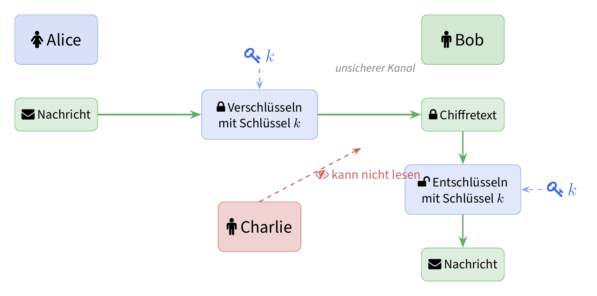

# Einstieg: Geheime Kommunikation

Stellen Sie sich folgende Situation vor: **Alice** möchte eine geheime Nachricht an **Bob** schicken. Das Problem: **Charlie** kann alle Nachrichten mitlesen, die zwischen Alice und Bob verschickt werden.

::: {.callout-tip title="Aufgabe 1: Eigenes Verschlüsselungsverfahren" icon=true}
Überlegen Sie sich in Zweiergruppen ein Verfahren, mit dem Alice eine Nachricht so verschlüsseln kann, dass nur Bob sie lesen kann — nicht aber Charlie.

- Wie wird die Nachricht verändert (verschlüsselt)?
- Was muss Bob wissen, um die Nachricht wieder lesen zu können?
- Könnte Charlie Ihr Verfahren knacken? Wie?

**Halten Sie Ihr Verfahren schriftlich fest und testen Sie es mit einer kurzen Beispielnachricht.**
:::

## Das Grundprinzip

Die folgende Grafik zeigt das Grundprinzip der **symmetrischen Verschlüsselung**: Alice verschlüsselt eine Nachricht mit einem Schlüssel $k$, schickt den Chiffretext über einen unsicheren Kanal an Bob, und Bob entschlüsselt mit demselben Schlüssel $k$. Charlie sieht zwar den Chiffretext, kann ihn aber ohne den Schlüssel nicht lesen.

{fig-align="center" width=70%}

Zentrale Begriffe:

| Begriff | Bedeutung |
|---|---|
| **Klartext** | Die ursprüngliche, lesbare Nachricht |
| **Chiffretext** | Die verschlüsselte, unlesbare Nachricht |
| **Schlüssel** | Die geheime Information zum Ver-/Entschlüsseln |
| **Verschlüsseln** | Klartext → Chiffretext |
| **Entschlüsseln** | Chiffretext → Klartext |

# Caesar-Verschlüsselung

Eines der ältesten bekannten Verschlüsselungsverfahren ist die **Caesar-Verschlüsselung**, benannt nach Julius Caesar, der sie zur Kommunikation mit seinen Generälen verwendet haben soll.

## Das Prinzip

Jeder Buchstabe im Klartext wird um eine feste Anzahl Positionen im Alphabet verschoben. Bei einer Verschiebung von $k = 3$:

| A | B | C | D | E | F | ... | X | Y | Z |
|---|---|---|---|---|---|-----|---|---|---|
| D | E | F | G | H | I | ... | A | B | C |

Das Wort **HALLO** wird mit $k = 3$ zu **KDOOR**.

Mathematisch ausgedrückt:

$$
c = (p + k) \mod 26
$$

wobei $c$ der Chiffrebuchstabe, $p$ der Klartextbuchstabe (als Zahl 0–25) und $k$ der Schlüssel ist.

## Interaktive Caesar-Drehscheibe

Verwenden Sie die Drehscheibe unten, um Nachrichten zu verschlüsseln und zu entschlüsseln. Der äussere Ring zeigt das Klartextalphabet, der innere Ring das verschobene Chiffrealphabet. Verändern Sie die Verschiebung mit dem Schieberegler.

```{=html}
<style>
  .caesar-widget {
    font-family: 'Source Sans Pro', sans-serif;
    max-width: 500px;
    margin: 1.5em auto;
    text-align: center;
  }
  .caesar-widget .disk-container {
    position: relative;
    width: 340px;
    height: 340px;
    margin: 0 auto 1em;
  }
  .caesar-widget svg {
    width: 340px;
    height: 340px;
  }
  .caesar-widget .controls {
    margin: 0.5em 0;
  }
  .caesar-widget .controls label {
    font-weight: 600;
    font-size: 1.05em;
  }
  .caesar-widget input[type=range] {
    width: 250px;
    margin: 0.3em 0;
  }
  .caesar-widget .shift-display {
    font-size: 1.4em;
    font-weight: 700;
    color: #4169E1;
    margin: 0.2em 0 0.6em;
  }
  .caesar-widget .io-area {
    display: flex;
    gap: 1em;
    justify-content: center;
    flex-wrap: wrap;
  }
  .caesar-widget .io-area div {
    flex: 1;
    min-width: 200px;
  }
  .caesar-widget textarea {
    width: 100%;
    height: 60px;
    font-family: monospace;
    font-size: 1em;
    padding: 0.4em;
    border: 1.5px solid #ccc;
    border-radius: 6px;
    resize: none;
  }
  .caesar-widget .io-area label {
    font-weight: 600;
    display: block;
    margin-bottom: 0.2em;
  }
</style>

<div class="caesar-widget" id="caesarWidget">
  <div class="disk-container">
    <svg id="caesarDisk" viewBox="0 0 340 340"></svg>
  </div>
  <div class="controls">
    <label for="shiftSlider">Verschiebung (k):</label><br>
    <input type="range" id="shiftSlider" min="0" max="25" value="3">
    <div class="shift-display">k = <span id="shiftValue">3</span></div>
  </div>
  <div class="io-area">
    <div>
      <label for="plainInput">Klartext:</label>
      <textarea id="plainInput" placeholder="Nachricht eingeben..."></textarea>
    </div>
    <div>
      <label for="cipherOutput">Chiffretext:</label>
      <textarea id="cipherOutput" placeholder="Verschlüsselt..." readonly></textarea>
    </div>
  </div>
</div>

<script>
(function() {
  const ABC = 'ABCDEFGHIJKLMNOPQRSTUVWXYZ';
  const cx = 170, cy = 170;
  // Outer ring (plain): 160 → 132, text at midpoint 146
  const rOO = 160, rOI = 132, rTO = 146;
  // Inner ring (cipher): 128 → 95, text at midpoint 112
  const rIO = 128, rII = 95, rTI = 112;

  function drawDisk(shift) {
    const svg = document.getElementById('caesarDisk');
    let html = '';
    // Outer ring
    html += `<circle cx="${cx}" cy="${cy}" r="${rOO}" fill="#e8ecf4" stroke="#4169E1" stroke-width="2"/>`;
    html += `<circle cx="${cx}" cy="${cy}" r="${rOI}" fill="white" stroke="#4169E1" stroke-width="1.5"/>`;
    // Inner ring
    html += `<circle cx="${cx}" cy="${cy}" r="${rIO}" fill="#e6f4ea" stroke="#228B22" stroke-width="2"/>`;
    html += `<circle cx="${cx}" cy="${cy}" r="${rII}" fill="white" stroke="#228B22" stroke-width="1.5"/>`;

    for (let i = 0; i < 26; i++) {
      const angle = (i * 360 / 26 - 90) * Math.PI / 180;
      // Outer letter (plain)
      const xo = cx + rTO * Math.cos(angle);
      const yo = cy + rTO * Math.sin(angle);
      html += `<text x="${xo}" y="${yo}" text-anchor="middle" dominant-baseline="central"
                font-size="13" font-weight="700" fill="#4169E1">${ABC[i]}</text>`;
      // Inner letter (cipher, shifted)
      const xi = cx + rTI * Math.cos(angle);
      const yi = cy + rTI * Math.sin(angle);
      html += `<text x="${xi}" y="${yi}" text-anchor="middle" dominant-baseline="central"
                font-size="13" font-weight="700" fill="#228B22">${ABC[(i + shift) % 26]}</text>`;
      // Tick marks between rings
      const x1 = cx + rOI * Math.cos(angle);
      const y1 = cy + rOI * Math.sin(angle);
      const x2 = cx + rIO * Math.cos(angle);
      const y2 = cy + rIO * Math.sin(angle);
      html += `<line x1="${x1}" y1="${y1}" x2="${x2}" y2="${y2}" stroke="#bbb" stroke-width="0.5"/>`;
    }
    // Center label
    html += `<text x="${cx}" y="${cy}" text-anchor="middle" dominant-baseline="central"
              font-size="16" font-weight="700" fill="#333">k = ${shift}</text>`;
    svg.innerHTML = html;
  }

  function caesarEncrypt(text, shift) {
    return text.toUpperCase().split('').map(ch => {
      const idx = ABC.indexOf(ch);
      if (idx === -1) return ch;
      return ABC[(idx + shift) % 26];
    }).join('');
  }

  const slider = document.getElementById('shiftSlider');
  const shiftDisp = document.getElementById('shiftValue');
  const plainIn = document.getElementById('plainInput');
  const cipherOut = document.getElementById('cipherOutput');

  function update() {
    const k = parseInt(slider.value);
    shiftDisp.textContent = k;
    drawDisk(k);
    cipherOut.value = caesarEncrypt(plainIn.value, k);
  }

  slider.addEventListener('input', update);
  plainIn.addEventListener('input', update);
  update();
})();
</script>
```

## Aufgaben

::: {.callout-note title="Aufgabe 2: Verschlüsseln" icon=true}
Verschlüsseln Sie die folgende Nachricht von Hand und überprüfen Sie Ihr Ergebnis mit der Drehscheibe.

> **TREFFPUNKT AM BAHNHOF**

Verwenden Sie den Schlüssel $k = 7$.
:::

::: {.callout-note title="Aufgabe 3: Knacken" icon=true}
Die folgende Nachricht wurde mit einer Caesar-Verschlüsselung verschlüsselt. Finden Sie den Schlüssel und den Klartext!

> **LQIRUPDWLN LVW HLQH VSDQQHQGH ZLVVHQVFKDIW**

*Tipp: Probieren Sie verschiedene Verschiebungen aus. Verwenden Sie die Drehscheibe zur Hilfe.*
:::

::: {.callout-warning title="Aufgabe 4: Sicherheit der Caesar-Verschlüsselung" icon=true}
Beantworten Sie die folgenden Fragen:

a) Wie viele mögliche Schlüssel gibt es bei der Caesar-Verschlüsselung?
b) Wenn Sie pro Sekunde einen Schlüssel ausprobieren können — wie lange dauert es maximal, alle Schlüssel durchzuprobieren?
c) Ist die Caesar-Verschlüsselung ein sicheres Verfahren? Begründen Sie Ihre Antwort.
d) Wie könnte man die Caesar-Verschlüsselung verbessern?
:::

# Monoalphabetische Substitution

## Das Prinzip

Bei der **monoalphabetischen Substitution** wird jeder Buchstabe des Klartexts durch einen fest zugeordneten anderen Buchstaben ersetzt — die Zuordnung ist beliebig wählbar. Die Caesar-Verschlüsselung ist ein Spezialfall: Die Zuordnung ist immer eine gleichmässige Verschiebung.

Allgemeines Beispiel einer Zuordnung:

| Klartext    | A | B | C | D | E | F | G | H | I | J | K | L | M | N | O | P | Q | R | S | T | U | V | W | X | Y | Z |
|-------------|---|---|---|---|---|---|---|---|---|---|---|---|---|---|---|---|---|---|---|---|---|---|---|---|---|---|
| Chiffretext | Q | W | E | R | T | Z | U | I | O | P | A | S | D | F | G | H | J | K | L | Y | X | C | V | B | N | M |

::: {.callout-note title="Aufgabe 5: Schlüsselraum" icon=true}
Bei der Caesar-Verschlüsselung gibt es nur 25 sinnvolle Schlüssel — *Brute Force* reicht vollkommen aus.

Wie viele verschiedene Schlüssel gibt es bei der allgemeinen monoalphabetischen Substitution mit 26 Buchstaben?

::: {.callout-tip title="Hinweis" collapse=true icon=true}
Auf wie viele Buchstaben kann A abgebildet werden? Danach B (A ist bereits vergeben)? Danach C? …
:::
:::

## Häufigkeitsanalyse

Mit 
<!-- $26! \approx 4 \times 10^{26}$  -->
$\dots$
möglichen Schlüsseln ist Brute Force nicht mehr praktikabel. Trotzdem ist die monoalphabetische Substitution unsicher — denn die **Häufigkeiten der Buchstaben bleiben erhalten**.

```{=html}
<div id="freqChart" style="font-family:'Source Sans Pro',sans-serif; max-width:520px; margin:1.5em auto;"></div>
<script>
(function() {
  const freqs = [
    ['E',17.40],['N',9.78],['I',7.55],['S',7.27],['R',7.00],
    ['A',6.51],['T',6.15],['D',5.08],['H',4.76],['U',4.35],
    ['L',3.44],['C',3.06],['G',3.01],['M',2.53],['O',2.51],
    ['B',1.89],['W',1.89],['F',1.66],['K',1.21],['Z',1.13],
    ['P',0.79],['V',0.67],['ẞ',0.31],['J',0.27],['Y',0.04],['X',0.03],['Q',0.02]
  ];
  const max = freqs[0][1];
  const container = document.getElementById('freqChart');
  let html = '<div style="font-size:0.85em;color:#555;margin-bottom:0.6em;">Buchstabenhäufigkeiten im Deutschen (in %)</div>';
  html += '<div style="display:grid;grid-template-columns:1.6em 1fr 3.2em;gap:4px 8px;align-items:center;">';
  for (const [letter, freq] of freqs) {
    const pct = (freq / max * 100).toFixed(0);
    const color = freq >= 7 ? '#4169E1' : freq >= 3 ? '#6688cc' : '#99aadd';
    html += `<span style="font-weight:700;color:${color};text-align:right;">${letter}</span>` +
            `<div style="background:#e8ecf4;border-radius:3px;height:15px;">` +
            `<div style="width:${pct}%;background:${color};border-radius:3px;height:100%;"></div></div>` +
            `<span style="font-size:0.85em;color:#555;">${freq.toFixed(1)}</span>`;
  }
  html += '</div>';
  container.innerHTML = html;
})();
</script>
```

Kommt ein Buchstabe im Chiffretext häufig vor, entspricht er wahrscheinlich einem häufigen Klartextbuchstaben. Durch systematisches Zuordnen lässt sich der Schlüssel Schritt für Schritt rekonstruieren.

## Aufgaben

::: {.callout-note title="Aufgabe 6: Häufigkeiten in normalem Text" icon=true}
Analysieren Sie die Häufigkeiten in einem selbst gewählten deutschen Text:

[CyberChef öffnen](https://gchq.github.io/CyberChef/#recipe=Frequency_distribution(false,true)){target="_blank"}

Fügen Sie einen beliebigen deutschen Text ein und beobachten Sie die Häufigkeitsanalyse. Welcher Buchstabe kommt am häufigsten vor? Stimmt das Ergebnis mit der Grafik oben überein?
:::

::: {.callout-warning title="Aufgabe 7: Entschlüsseln per Häufigkeitsanalyse" icon=true}
Gegeben ist ein verschlüsselter Text. 

```
JAW FPJDOAS ADLHQEADUQ EQUSTQEWWVWUQF ZTSJ CPN WPLUZASQQNUZTYMOQSN ADL JQS HANKQN ZQOU ZQTUQSQNUZTYMQOU, JTQ AN JQN CQSWYXTQJQNQN RSPBQMUQN FTUASEQTUQN. AN JQS QNUZTYMODNH WTNJ DNUQSNQXFQN, NPNRSPLTU-PSHANTWAUTPNQN DNJ CTQOQ LSQTZTOOTHQ EQUQTOTHU. EQTF HQESADYX ADL YPFRDUQSN MPFFQN FQTWU WPHQNANNUQ OTNDG-JTWUSTEDUTPNQN KDF QTNWAUK. QTNQ JTWUSTEDUTPN LAWWU JQN OTNDG-MQSNQO FTU CQSWYXTQJQNQS WPLUZASQ KD QTNQF EQUSTQEWWVWUQF KDWAFFQN, JAW LDQS JTQ QNJNDUKDNH HQQTHNQU TWU. JAEQT RAWWQN CTQOQ JTWUSTEDUPSQN DNJ CQSWTQSUQ EQNDUKQS JTQ WPLUZASQ AN TXSQ QTHQNQN KZQYMQ AN.

OTNDG ZTSJ CTQOLAQOUTH DNJ DFLAWWQNJ QTNHQWQUKU, EQTWRTQOWZQTWQ ADL ASEQTUWROAUKSQYXNQSN, WQSCQSN, FPETOUQOQLPNQN, SPDUQSN, NPUQEPPMW, QFEQJJQJ WVWUQFW, FDOUTFQJTA-QNJHQSAQUQN DNJ WDRQSYPFRDUQSN. JAEQT ZTSJ OTNDG DNUQSWYXTQJOTYX XAQDLTH HQNDUKU: WP TWU OTNDG TF WQSCQS-FASMU ZTQ ADYX TF FPETOQN EQSQTYX QTNQ LQWUQ HSPQWWQ, ZAQXSQNJ QW ADL JQF JQWMUPR DNJ OARUPRW QTNQ HQSTNHQ SPOOQ WRTQOU. TF NPCQFEQS 2023 ZAS QW TN JQDUWYXOANJ ADL YA. 2,8 % JQS JQWMUPR-WVWUQFQ TNWUAOOTQSU, DNJ QSSQTYXUQ ANLANH 2024 QSWUFAOW QTNQ ZQOUZQTUQ CQSESQTUDNH CPN DQEQS 4 %.
```

Entschlüsseln Sie ihn mithilfe der Häufigkeitsanalyse.

**Schritt 1** — Öffnen Sie den Chiffretext und analysieren Sie die Buchstabenhäufigkeiten:

[Chiffretext mit Häufigkeitsanalyse öffnen](https://gchq.github.io/CyberChef/#recipe=Frequency_distribution(false,true)&input=SkFXIEZQSkRPQVMgQURMSFFFQURVUSBFUVVTVFFFV1dWV1VRRiBaVFNKIENQTiBXUExVWkFTUVFOVVpUWU1PUVNOIEFETCBKUVMgSEFOS1FOIFpRT1UgWlFUVVFTUU5VWlRZTVFPVSwgSlRRIEFOIEpRTiBDUVNXWVhUUUpRTlFOIFJTUEJRTVVRTiBGVFVBU0VRVFVRTi4gQU4gSlFTIFFOVVpUWU1PRE5IIFdUTkogRE5VUVNOUVhGUU4sIE5QTlJTUExUVS1QU0hBTlRXQVVUUE5RTiBETkogQ1RRT1EgTFNRVFpUT09USFEgRVFVUVRPVEhVLiBFUVRGIEhRRVNBRFlYIEFETCBZUEZSRFVRU04gTVBGRlFOIEZRVFdVIFdQSFFOQU5OVVEgT1ROREctSlRXVVNURURVVFBOUU4gS0RGIFFUTldBVUsuIFFUTlEgSlRXVVNURURVVFBOIExBV1dVIEpRTiBPVE5ERy1NUVNOUU8gRlRVIENRU1dZWFRRSlFOUVMgV1BMVVpBU1EgS0QgUVROUUYgRVFVU1RRRVdXVldVUUYgS0RXQUZGUU4sIEpBVyBMRFFTIEpUUSBRTkpORFVLRE5IIEhRUVRITlFVIFRXVS4gSkFFUVQgUkFXV1FOIENUUU9RIEpUV1VTVEVEVVBTUU4gRE5KIENRU1dUUVNVUSBFUU5EVUtRUyBKVFEgV1BMVVpBU1EgQU4gVFhTUSBRVEhRTlFOIEtaUVlNUSBBTi4KCk9UTkRHIFpUU0ogQ1RRT0xBUU9VVEggRE5KIERGTEFXV1FOSiBRVE5IUVdRVUtVLCBFUVRXUlRRT1daUVRXUSBBREwgQVNFUVRVV1JPQVVLU1FZWE5RU04sIFdRU0NRU04sIEZQRVRPVVFPUUxQTlFOLCBTUERVUVNOLCBOUFVRRVBQTVcsIFFGRVFKSlFKIFdWV1VRRlcsIEZET1VURlFKVEEtUU5KSFFTQVFVUU4gRE5KIFdEUlFTWVBGUkRVUVNOLiBKQUVRVCBaVFNKIE9UTkRHIEROVVFTV1lYVFFKT1RZWCBYQVFETFRIIEhRTkRVS1U6IFdQIFRXVSBPVE5ERyBURiBXUVNDUVMtRkFTTVUgWlRRIEFEWVggVEYgRlBFVE9RTiBFUVNRVFlYIFFUTlEgTFFXVVEgSFNQUVdXUSwgWkFRWFNRTkogUVcgQURMIEpRRiBKUVdNVVBSIEROSiBPQVJVUFJXIFFUTlEgSFFTVE5IUSBTUE9PUSBXUlRRT1UuIFRGIE5QQ1FGRVFTIDIwMjMgWkFTIFFXIFROIEpRRFVXWVhPQU5KIEFETCBZQS4gMiw4ICUgSlFTIEpRV01VUFItV1ZXVVFGUSBUTldVQU9PVFFTVSwgRE5KIFFTU1FUWVhVUSBBTkxBTkggMjAyNCBRU1dVRkFPVyBRVE5RIFpRT1VaUVRVUSBDUVNFU1FUVUROSCBDUE4gRFFFUVMgNCAlLg){target="_blank"}

**Schritt 2** — Öffnen Sie die Substitutions-Funktion und passen Sie die Zuordnung an:

[Substitution öffnen](https://gchq.github.io/CyberChef/#recipe=Substitute('ABCDEFGHIJKLMNOPQRSTUVWXYZ','ABCDEFGHIJKLMNOPQRSTUVWXYZ',false)&input=SkFXIEZQSkRPQVMgQURMSFFFQURVUSBFUVVTVFFFV1dWV1VRRiBaVFNKIENQTiBXUExVWkFTUVFOVVpUWU1PUVNOIEFETCBKUVMgSEFOS1FOIFpRT1UgWlFUVVFTUU5VWlRZTVFPVSwgSlRRIEFOIEpRTiBDUVNXWVhUUUpRTlFOIFJTUEJRTVVRTiBGVFVBU0VRVFVRTi4gQU4gSlFTIFFOVVpUWU1PRE5IIFdUTkogRE5VUVNOUVhGUU4sIE5QTlJTUExUVS1QU0hBTlRXQVVUUE5RTiBETkogQ1RRT1EgTFNRVFpUT09USFEgRVFVUVRPVEhVLiBFUVRGIEhRRVNBRFlYIEFETCBZUEZSRFVRU04gTVBGRlFOIEZRVFdVIFdQSFFOQU5OVVEgT1ROREctSlRXVVNURURVVFBOUU4gS0RGIFFUTldBVUsuIFFUTlEgSlRXVVNURURVVFBOIExBV1dVIEpRTiBPVE5ERy1NUVNOUU8gRlRVIENRU1dZWFRRSlFOUVMgV1BMVVpBU1EgS0QgUVROUUYgRVFVU1RRRVdXVldVUUYgS0RXQUZGUU4sIEpBVyBMRFFTIEpUUSBRTkpORFVLRE5IIEhRUVRITlFVIFRXVS4gSkFFUVQgUkFXV1FOIENUUU9RIEpUV1VTVEVEVVBTUU4gRE5KIENRU1dUUVNVUSBFUU5EVUtRUyBKVFEgV1BMVVpBU1EgQU4gVFhTUSBRVEhRTlFOIEtaUVlNUSBBTi4KCk9UTkRHIFpUU0ogQ1RRT0xBUU9VVEggRE5KIERGTEFXV1FOSiBRVE5IUVdRVUtVLCBFUVRXUlRRT1daUVRXUSBBREwgQVNFUVRVV1JPQVVLU1FZWE5RU04sIFdRU0NRU04sIEZQRVRPVVFPUUxQTlFOLCBTUERVUVNOLCBOUFVRRVBQTVcsIFFGRVFKSlFKIFdWV1VRRlcsIEZET1VURlFKVEEtUU5KSFFTQVFVUU4gRE5KIFdEUlFTWVBGUkRVUVNOLiBKQUVRVCBaVFNKIE9UTkRHIEROVVFTV1lYVFFKT1RZWCBYQVFETFRIIEhRTkRVS1U6IFdQIFRXVSBPVE5ERyBURiBXUVNDUVMtRkFTTVUgWlRRIEFEWVggVEYgRlBFVE9RTiBFUVNRVFlYIFFUTlEgTFFXVVEgSFNQUVdXUSwgWkFRWFNRTkogUVcgQURMIEpRRiBKUVdNVVBSIEROSiBPQVJVUFJXIFFUTlEgSFFTVE5IUSBTUE9PUSBXUlRRT1UuIFRGIE5QQ1FGRVFTIDIwMjMgWkFTIFFXIFROIEpRRFVXWVhPQU5KIEFETCBZQS4gMiw4ICUgSlFTIEpRV01VUFItV1ZXVVFGUSBUTldVQU9PVFFTVSwgRE5KIFFTU1FUWVhVUSBBTkxBTkggMjAyNCBRU1dVRkFPVyBRVE5RIFpRT1VaUVRVUSBDUVNFU1FUVUROSCBDUE4gRFFFUVMgNCAlLg){target="_blank"}

Vergleichen Sie die häufigsten Chiffrebuchstaben mit der deutschen Häufigkeitstabelle und ordnen Sie diese zu. Verfeinern Sie die Zuordnung schrittweise, bis der Klartext lesbar wird.

**Extra Challenge**

[Substitution öffnen](https://gchq.github.io/CyberChef/#recipe=Substitute('0123456789ABCDEFGHIJKLMNOPQRSTUVWXYZabcdefghijklmnopqrstuvwxyz','0123456789ABCDEFGHIJKLMNOPQRSTUVWXYZabcdefghijklmnopqrstuvwxyz',false)&input=eVc5IGFXSjkzS0sgaTNGc21QNiAoV0ZKNTM2MngsIEc1VDlINSBLVDkgY1dGNmxXOSkgMzZsIFczRlcgYVdYVzMyeEZURkogS1Q5IDFtS2xQSDlXLVNWVzlLNUgyeFdGVzVXYldGbFcgVEZzIEpXeGwgSFRLIHNINiAzRiBzV0YgSzlUeFdGIHZNaHJXOSBESHg5V0YgM2IgcVc5bWUgR1pRayBXRmxQMzJ6VzVsVyBpakFHLUdIOUhzM0piSCAoaTNGc21QLCBqMm1GLCBBV0ZULCBHbTNGbDNGSi15V3UzMlcpIEtUOSBzV0YgWlRLVkhUIHVtRiBhV0ZUbFhXOTYyeEYzbGw2bFc1NVdGIFhUOVQyei4gQTMyOW02bUtsIGkzRnNtUDYgSld4bTlsIFhUIHNXRiBKOUhLMzYyeFdGIGFXbDkzV1Y2Njc2bFdiV0YsIHMzVyBzM1c2VzYgR0g5SHMzSmJIIFRiNldsWFdGLiBTS2wgNmxXeGwgaTNGc21QNiDigJMgUDNXIEhUMnggc1c5IGFXSjkzS0sgaTNGc21QNi1HayBLVDkgaTNGc21QNiBIVEsgc1c5IGVSSS1aOTJ4M2xXemxUOSBzVzYgVDk2NDlURko1MzJ4V0YgamFBIEdrIOKAkyBINTYgRzVIbGxLbTliIFRGcyAxNDNXNVc0NUhsbEttOWIgS1Q5IEc5bUo5SGJiVyBURnMga21iNFRsVzk2NDNXNVcsIHMzVyBURmxXOSBpM0ZzbVA2LXRXOTYzbUZXRiA1SFRLV0YsIHMzVyBYVDkgRVczbCAzeDlXOSB0VzltS0tXRmw1MzJ4VEZKIFRGbFc5NmxUbFhsIFBUOXNXRi4gWjU2IGkzRnNtUDYga2QgUDM5cyBzSDYgYVdsOTNXVjY2NzZsV2IgSFQyeCAzRiBXM0ZKV1ZXbGxXbFdGIDBXOUhsV0YgVzNGSlc2V2xYbDsgVzYgMzZsIEhUNjZXOXNXYiBhV2w5M1dWNjY3NmxXYiBINTVXOSAwV0ZXOUhsM21GV0Ygc1c5IHFWbWUtT21GNm01V0YuCgppM0ZzbVA2LUc5bUo5SGJiVyBWWFAuIGkzRnNtUDYtMTQzVzVXIHptRkZXRiBIVDJ4IFRGbFc5IEZXVFc5V0YgKDZXNWxXRiBIVDJ4IEg1bFc5V0YpIHRXOTYzbUZXRiB1bUYgaTNGc21QNiBKV0ZUbFhsIFBXOXNXRiwgbVZQbXg1IFBXc1c5IEEzMjltNm1LbCBGbTJ4IHNXOSBnVzk2bFc1NVc5IHNIS1Q5IDBXUEh4OTVXMzZsVEZKV0YgSFZKV1ZXRi4gblczNTYgSjNWbCBXNiBIVDJ4IGY0c0hsVzYgbXNXOSBHSGwyeFc2LCBzM1cgT21iNEhsM1YzNTNsSGwgWFQgVzNGVzkgRldUVzlXRiAobXNXOSBINWxXOVdGKSBpM0ZzbVA2LXRXOTYzbUYgeFc5NmxXNTVXRi4KCnlINiBUOTY0OVRGSjUzMnhXIGkzRnNtUDYgc1c5IHZNUnJXOSBESHg5VyBQSDkgVzNGVyBKOUhLMzYyeFcgZDlQVzNsVzlURkogS1Q5IHMzVyBHay1HNUhsbEttOWIgVEZzIEdrLXptYjRIbDNWNVc2IHlTMSwgSDU1V0YgdW05SEYgQTEteVMxIChINTYg4oCeeVMxLUdr4oCcIGIzbCBzV2IgRkh4V1hUIDNzV0ZsMzYyeFdGIEdrIHlTMSBINTYgUVdLVzlXRlgtRzVIbGxLbTliKS4gWnhGNTMyeFcgem1GelQ5OTNXOVdGc1cgMTc2bFdiVyBQSDlXRiBWVzM2NDNXNTZQVzM2VyBzSDYgejVINjYzNjJ4VyBBSDIgUzEgKHVtRiBzV2IgVzYgM0Y2NDM5M1c5bCBQSDkpLCAwZEEgbXNXOSBHay8wZFMxLiB5M1c2VzkgVDk2NDlURko1MzJ4VyBKOUhLMzYyeFcgeVMxLVpUSzZIbFggUFQ5c1cgYjNsIGkzRnNtUDYgTW8gVGIgVzNGV0YgVFZXOUg5VlczbFdsV0YgT1c5Rlc1LCBzVzkgcEwtYTNsLWkzRnNtUDYtWkdqIGkzRnBMIChLVDkgV0ZKNTM2MnggWjQ0NTMySGwzbUYgRzltSjlIYmIzRkogakZsVzlLSDJXLCBHOW1KOUhiYjNXOTYyeEYzbGw2bFc1NVcpIFRGcyBqRmxXOUZXbEtIeDNKelczbCBXOVBXM2xXOWwgVEZzIFYzNiBYVDkgQTM1NVdGRjNUYiBkczNsM21GIHVtRiBkRnNXIExycnIgUFczbFc5SldLVHg5bC4gY1Q5IHNXOUg5bDNKVyBpM0ZzbVA2LWFXbDkzV1Y2Njc2bFdiVywgczNXIEhUSyBXM0YgM0ZsV0o5M1c5bFc2IFRGcyBiM2xKVzUzV0tXOWxXNiBBMS15UzEgSEZKV1AzVzZXRiA2M0ZzLCB4SGwgNjMyeCBzM1cgMUhiYlc1VldYVzMyeEZURkogaTNGc21QNiBNZSBXbEhWNTNXOWwuCgpHSDlINTVXNSBYVDkg4oCeeVMxLU4zRjNX4oCcIFBUOXNXIFRGbFc5IHNXOSBOVzNsVEZKIHVtRiB5SHUzcyA4LiBrVGw1VzkgSFYgdk1SUiBzSDYgSFRLIHNXRiBPbUZYVzRsV0Ygc1c2IGFXbDkzV1Y2Njc2bFdiNiB0QTEgVkg2M1c5V0ZzVyBpM0ZzbVA2IDhuIFdGbFAzMnpXNWwgVEZzIEg1NiBibXNXOUZXOVcgWjVsVzlGSGwzdVcgRldWV0YgaTNGc21QNiBwLmUgVlhQLiBpM0ZzbVA2IE1lIDRtNjNsM21GM1c5bC4geUggczNXIOKAnjhuLU4zRjNX4oCcIEhWVzkgM0Ygc1dGIHZNTXJXOSBESHg5V0YgWkY2NDlUMnhXIEhGIHMzVyBnSDlzUEg5VyA2bFc1NWxXLCBzM1cgM2IgZmJLVzVzIHNXOSBnVzNiSEZQV0ZzVzkgRjMyeGwgVzlLVDU1Vkg5IDYyeDNXRldGLCB6bUZGbFcgaTNGc21QNiBNZSBsOW1sWCBzVzkgVzNGc1dUbDNKV0YgbFcyeEYzNjJ4V0YgMTJ4UEgyeFdGIHNUOTJ4IHNINiB5UzEtVkg2M1c5bFcgY1RGc0hiV0ZsIFc5NmwgYjNsIHNXOSB0VzltS0tXRmw1MzJ4VEZKIHVtRiBpM0ZzbVA2IHFHIExycnYgV0ZzSlQ1bDNKIHNUOTJ4IHNINiBibXNXOUZXOVcgMTc2bFdiIFc5NldsWGwgUFc5c1dGLiAxVzNseFc5IHVXOWw5VzNWbCBBMzI5bTZtS2wgS1Q5IHNXRiB5VzZ6bG00IEZUOSBGbTJ4IHNINiBIVEsgc1c5IOKAnjhuLU4zRjNX4oCcIFZINjNXOVdGc1cgaTNGc21QNiwgc0g2IEttOWxIRiBteEZXIOKAnjhu4oCcIDNiIDhIYldGIEg1NiBBMzI5bTZtS2wgaTNGc21QNiBLbTlsSldLVHg5bCBQMzlzLgoKaTNGc21QNi1hV2w5M1dWNjY3NmxXYlcgNjNGcyB1bTkgSDU1V2IgSFRLIChGMzJ4bCBGVDksIEhWVzkgSjltNjZsVzM1NiBqYUEtR2stem1iNEhsM1Y1V0YpIEdXOTZtRkg1IGttYjRUbFc5RiwgaW05ejZsSGwzbUY2IFRGcyAxVzl1VzlGIHVXOVY5VzNsV2w7IHNIRldWV0YgV2UzNmwzVzlXRiB0SDkzSEZsV0YgS1Q5IDBXOUhsVyBQM1cgMWJIOWw0eG1GVzYgbXNXOSBHeVo2IDZtUDNXIEtUOSA2NFdYM1c1NVcgZGJWV3NzV3MgeVd1MzJXNiBQM1cgV2xQSCB1bTU1VzVXemw5bUYzNjJ4VyBBVzY2Slc5SGxXIFRGcyBkM0ZYVzV4SEZzVzU2LU9INjZXRjY3NmxXYlcgbXNXOSBLVDkgczNXIFpGUFdGc1RGSiAzRiBPOUhLbEtIeDlYV1RKV0YuIE9XdTNGIG5UOUZXOSwgc1c5IGt4M1dLIFM0VzlIbDNGSiBTS0szMlc5IHVtRiBBMzI5bTZtS2wsIEZIRkZsVyBIVEsgc1c5IGltOTVzUDNzVyBHSDlsRlc5IGttRktXOVdGMlcgTHJ2dyBXM0ZXRiAwVzZIYmwtQUg5emxIRmxXMzUgdW1GIHZ3IEc5bVhXRmwgS1Q5IEg1NVcgaTNGc21QNi10SDkzSEZsV0YuIHlXOSBQVzVsUFczbFcgQUg5emxIRmxXMzUgc1c2IEh6bFRXNTVXRiBhV2w5M1dWNjY3NmxXYjYgaTNGc21QNiB2ciBIVEsgSDU1V0Yga21iNFRsVzlGIDVISiAzYiBTemxtVlc5IExyTHIgVlczIElMLHZJICUu&oenc=65001){target="_blank"}

:::


# Vigenère-Verschlüsselung

Für Jahrhunderte galt das nach Blaise de Vigenère benannte Verfahren als unknackbar — es wurde als *«le chiffre indéchiffrable»* bezeichnet. Tatsächlich blieb es von seiner Entstehung im 16. Jahrhundert bis 1863 ungebrochen.

## Das Prinzip

Die monoalphabetische Substitution hat einen grundlegenden Schwachpunkt: **Jeder Klartextbuchstabe wird immer auf denselben Chiffrebuchstaben abgebildet.** Damit bleiben die Häufigkeitsverhältnisse erhalten.

Die **Vigenère-Verschlüsselung** beseitigt diesen Schwachpunkt, indem statt einer einzelnen Verschiebungszahl ein **Schlüsselwort** verwendet wird. Das Schlüsselwort wird zeichenweise dem Klartext zugeordnet und bei Bedarf **wiederholt** (*Schlüsselauffüllung*):

**Beispiel mit dem Schlüsselwort `KEY`:**

| Position      |  1 |  2 |  3 |  4 |  5 |  6 |  7 |  8 |  9 |
|:-------------|:--:|:--:|:--:|:--:|:--:|:--:|:--:|:--:|:--:|
| Klartext      |  H |  A |  L |  L |  O |  W |  E |  L |  T |
| Schlüssel     |  K |  E |  Y |  K |  E |  Y |  K |  E |  Y |
| Verschiebung  | +10| +4 |+24 | +10| +4 |+24 | +10| +4 |+24 |
| Chiffretext   |  R |  E |  J |  V |  S |  U |  O |  P |  R |

Jeder Schlüsselbuchstabe gibt eine Caesar-Verschiebung vor (K = 10, E = 4, Y = 24). Die Verschiebungen wiederholen sich mit der Schlüssellänge $m$:

$$
c_i = (p_i + k_{i \mod m}) \mod 26
$$

Beachten Sie: Das **L** taucht im Klartext dreimal auf — es wird einmal zu **J** (Verschiebung +24), einmal zu **V** (+10) und einmal zu **P** (+4) verschlüsselt. Damit wird die direkte Häufigkeitsanalyse unmöglich.

::: {.callout-tip title="Kernidee" icon=true}
Die Vigenère-Verschlüsselung entspricht **$m$ verschiedenen Caesar-Verschlüsselungen gleichzeitig**: Position $i$ wird mit dem Schlüsselbuchstaben an Position $i \mod m$ verschoben. Derselbe Klartextbuchstabe kann so zu verschiedenen Chiffrebuchstaben werden — und umgekehrt.
:::

::: {.callout-note title="Aufgabe 8: Von Hand verschlüsseln" icon=true}
Verschlüsseln Sie die folgende Nachricht von Hand mit dem Schlüsselwort **BUCH**.

> **HALLO WELT**

Füllen Sie dazu die Tabelle aus:

| Position      |  1 |  2 |  3 |  4 |  5 |    |  6 |  7 |  8 |  9 |
|:-------------|:--:|:--:|:--:|:--:|:--:|:--:|:--:|:--:|:--:|:--:|
| Klartext      | H  | A  | L  | L  | O  |    | W  | E  | L  | T  |
| Schlüssel     | B  | U  | C  | H  |    |    |    |    |    |    |
| Verschiebung  | +1 |+20 | +2 | +7 |    |    |    |    |    |    |
| Chiffretext   |    |    |    |    |    |    |    |    |    |    |

*Hinweis: Leerzeichen werden übersprungen und zählen nicht als Klartext­buchstabe.*

:::


## Interaktives Widget

Verwenden Sie das Widget, um Nachrichten mit einem beliebigen Schlüsselwort zu verschlüsseln oder zu entschlüsseln. Die Schlüsselausdehnung zeigt farblich, welcher Schlüsselbuchstabe an welcher Position wirkt.

```{=html}
<style>
  .vigenere-widget {
    font-family: 'Source Sans Pro', sans-serif;
    max-width: 580px;
    margin: 1.5em auto;
  }
  .vigenere-widget .vig-controls {
    display: flex;
    flex-wrap: wrap;
    gap: 0.7em 1.2em;
    align-items: center;
    margin-bottom: 0.8em;
  }
  .vigenere-widget .vig-key-row {
    display: flex;
    align-items: center;
    gap: 0.5em;
    flex-wrap: wrap;
  }
  .vigenere-widget .vig-key-row > label {
    font-weight: 600;
    white-space: nowrap;
  }
  .vigenere-widget #vigKey {
    font-family: monospace;
    font-size: 1.05em;
    padding: 0.2em 0.5em;
    border: 1.5px solid #ccc;
    border-radius: 5px;
    width: 120px;
    text-transform: uppercase;
    letter-spacing: 0.05em;
  }
  .vigenere-widget .vig-key-display {
    display: flex;
    flex-wrap: wrap;
    gap: 2px;
    align-items: center;
  }
  .vigenere-widget .vig-mode-row {
    display: flex;
    align-items: center;
    gap: 1em;
    font-size: 0.97em;
  }
  .vigenere-widget .vig-mode-row label {
    cursor: pointer;
  }
  .vigenere-widget .vig-io-area {
    display: flex;
    gap: 1em;
    flex-wrap: wrap;
  }
  .vigenere-widget .vig-io-area > div {
    flex: 1;
    min-width: 200px;
  }
  .vigenere-widget .vig-io-area label {
    font-weight: 600;
    display: block;
    margin-bottom: 0.2em;
  }
  .vigenere-widget textarea {
    width: 100%;
    height: 60px;
    font-family: monospace;
    font-size: 1em;
    padding: 0.4em;
    border: 1.5px solid #ccc;
    border-radius: 6px;
    resize: none;
  }
  .vigenere-widget .vig-exp-label {
    font-size: 0.82em;
    color: #777;
    margin: 0.8em 0 0.25em;
  }
  .vigenere-widget .vig-expansion {
    border: 1px solid #e0e0e0;
    border-radius: 6px;
    padding: 6px 10px;
    background: #fafafa;
    overflow-x: auto;
    min-height: 62px;
  }
</style>

<div class="vigenere-widget">
  <div class="vig-controls">
    <div class="vig-key-row">
      <label for="vigKey">Schlüsselwort:</label>
      <input type="text" id="vigKey" value="KEY" maxlength="20">
      <div class="vig-key-display" id="vigKeyDisplay"></div>
    </div>
    <div class="vig-mode-row">
      <strong>Modus:</strong>
      <label><input type="radio" name="vigMode" id="vigModeEnc" value="enc" checked> Verschlüsseln</label>
      <label><input type="radio" name="vigMode" id="vigModeDec" value="dec"> Entschlüsseln</label>
    </div>
  </div>
  <div class="vig-io-area">
    <div>
      <label id="vigInLabel" for="vigPlain">Klartext:</label>
      <textarea id="vigPlain" placeholder="Nachricht eingeben..."></textarea>
    </div>
    <div>
      <label id="vigOutLabel" for="vigCipher">Chiffretext:</label>
      <textarea id="vigCipher" readonly placeholder="..."></textarea>
    </div>
  </div>
  <div class="vig-exp-label">Schlüsselausdehnung (erste 50 Buchstaben):</div>
  <div class="vig-expansion" id="vigExpansion"></div>
</div>

<script>
(function() {
  var ABC = 'ABCDEFGHIJKLMNOPQRSTUVWXYZ';
  var KC = ['#4169E1','#C0392B','#27AE60','#D35400','#8E44AD',
            '#0097A7','#F57F17','#2980B9','#E91E63','#00796B',
            '#5D4037','#546E7A'];

  function cleanKey(s) {
    return s.toUpperCase().replace(/[^A-Z]/g, '');
  }

  function processText(text, key, dec) {
    var k = cleanKey(key);
    if (!k) return text.toUpperCase();
    var out = '', ki = 0;
    var up = text.toUpperCase();
    for (var i = 0; i < up.length; i++) {
      var ch = up[i];
      var pi = ABC.indexOf(ch);
      if (pi < 0) { out += ch; continue; }
      var sh = ABC.indexOf(k[ki % k.length]);
      out += dec ? ABC[(pi - sh + 26) % 26] : ABC[(pi + sh) % 26];
      ki++;
    }
    return out;
  }

  function renderExpansion(text, key, dec, max) {
    var k = cleanKey(key);
    if (!k || !text.trim()) {
      return '<em style="color:#bbb;font-size:0.9em;">Text und Schlüsselwort eingeben\u2026</em>';
    }
    var up = text.toUpperCase();
    var n = Math.min(up.length, max);
    var cols = '', ki = 0;
    for (var i = 0; i < n; i++) {
      var ch = up[i];
      var pi = ABC.indexOf(ch);
      var isL = pi >= 0;
      var ci = isL ? ki % k.length : -1;
      var clr = ci >= 0 ? KC[ci % KC.length] : '#ccc';
      var kch = isL ? k[ci] : '\u00a0';
      var och = '\u00a0';
      if (isL) {
        var sh = ABC.indexOf(kch);
        och = dec ? ABC[(pi - sh + 26) % 26] : ABC[(pi + sh) % 26];
        ki++;
      }
      var bg = ci >= 0 ? clr + '18' : 'transparent';
      var disp = ch === ' ' ? '\u00b7' : ch;
      cols += '<div style="display:flex;flex-direction:column;align-items:center;min-width:' + (isL ? 20 : 8) + 'px;padding:0 1px;background:' + bg + ';border-radius:3px;">' +
        '<span style="font-size:10px;font-weight:700;color:' + clr + ';height:17px;line-height:17px;">' + kch + '</span>' +
        '<span style="font-size:12px;color:#444;height:17px;line-height:17px;font-family:monospace;">' + disp + '</span>' +
        '<span style="font-size:12px;font-weight:700;color:' + clr + ';height:17px;line-height:17px;font-family:monospace;">' + och + '</span>' +
        '</div>';
    }
    var row2 = dec ? 'Chiffretext' : 'Klartext';
    var row3 = dec ? 'Klartext' : 'Chiffretext';
    return '<div style="display:flex;gap:4px;align-items:flex-start;">' +
      '<div style="flex-shrink:0;display:flex;flex-direction:column;color:#888;font-size:10px;text-align:right;padding-right:6px;border-right:1px solid #ddd;white-space:nowrap;">' +
      '<span style="height:17px;line-height:17px;">Schlüssel</span>' +
      '<span style="height:17px;line-height:17px;">' + row2 + '</span>' +
      '<span style="height:17px;line-height:17px;">' + row3 + '</span>' +
      '</div><div style="display:flex;flex-wrap:nowrap;">' + cols + '</div></div>';
  }

  function updateKeyDisplay(key) {
    var k = cleanKey(key);
    var el = document.getElementById('vigKeyDisplay');
    if (!k) { el.innerHTML = ''; return; }
    var h = '';
    for (var i = 0; i < k.length; i++) {
      var c = KC[i % KC.length];
      h += '<span style="color:' + c + ';font-weight:700;font-family:monospace;background:' + c + '18;padding:0 3px;border-radius:3px;font-size:1.05em;">' + k[i] + '</span>';
    }
    el.innerHTML = h;
  }

  function update() {
    var dec = document.getElementById('vigModeDec').checked;
    document.getElementById('vigInLabel').textContent = dec ? 'Chiffretext:' : 'Klartext:';
    document.getElementById('vigOutLabel').textContent = dec ? 'Klartext:' : 'Chiffretext:';
    var key = document.getElementById('vigKey').value;
    var text = document.getElementById('vigPlain').value;
    document.getElementById('vigCipher').value = processText(text, key, dec);
    document.getElementById('vigExpansion').innerHTML = renderExpansion(text, key, dec, 50);
    updateKeyDisplay(key);
  }

  ['vigKey', 'vigPlain'].forEach(function(id) {
    document.getElementById(id).addEventListener('input', update);
  });
  ['vigModeEnc', 'vigModeDec'].forEach(function(id) {
    document.getElementById(id).addEventListener('change', update);
  });
  update();
})();
</script>
```

## Häufigkeitsanalyse und Vigenère

Warum schlägt die einfache Häufigkeitsanalyse beim Vigenère-Verfahren fehl?

Bei einem Schlüsselwort der Länge $m = 3$ (z. B. KEY) gibt es **drei verschiedene Verschlüsselungen**, die abwechselnd angewendet werden:

- Positionen 1, 4, 7, 10, … → alle mit Verschiebung K = +10 (ein Caesar-Cipher)
- Positionen 2, 5, 8, 11, … → alle mit Verschiebung E = +4 (ein weiterer Caesar-Cipher)
- Positionen 3, 6, 9, 12, … → alle mit Verschiebung Y = +24 (ein dritter Caesar-Cipher)

Der häufigste deutsche Buchstabe **E** kann je nach Position als **O** (+10), **I** (+4) oder **C** (+24) erscheinen. Im Chiffretext sind diese drei Buchstaben zusammen ungefähr so häufig, aber **einzeln** sieht keiner davon ungewöhnlich oft aus. Die charakteristischen Häufigkeitsspitzen des Deutschen werden so **über mehrere Chiffrebuchstaben verteilt** und geglättet.

Je länger das Schlüsselwort, desto gleichmässiger die Häufigkeitsverteilung — bei einem Schlüssel, der genauso lang wie die Nachricht ist und zufällig gewählt wird, entsteht eine **perfekt gleichmässige Verteilung** (das Prinzip des One-Time-Pad).

## Aufgaben


::: {.callout-note title="Aufgabe 9: Entschlüsselungs-Strategien (10 min)" icon=true}
Die einfache Häufigkeitsanalyse versagt bei Vigenère, aber weil es sich trotzdem um $m$ verschiedene Caesar-Cipher handelt, kann man die üblichen Methoden angepasst anwenden.

Überlegen Sie sich eine Strategie, einen Vigenère-Chiffretext zu entschlüsseln. Ihre Strategie sollte folgende zwei Schritte beinhalten:

1. **Schlüssellänge ist unbekannt → Schlüssellänge $m$ bestimmen**
2. **$m$ ist bekannt → Schlüsselwort herausfinden**

:::

::: {.callout-warning title="Aufgabe 10: Entschlüsseln" icon=true}
Der folgende Text wurde mit Vigenère verschlüsselt. Schlüsselwort und Schlüssellänge sind unbekannt.

```
ESKGI CBRF JBDFLSEFLWISSGK ECL FJQ WEIGG KFLNXARXR QPHTSGXXBCKIO ZBXLCXTFP-LCTRXQT IHRORXR EGX PJLNB-LCKRFJ-XRUUBGLJXV EGXWFQ GMDFM QFFK OPQMIOJHW WCKAFLWIO, SGH TMFMU ZEMFZ OMFJXR FLMAJADPFPG HFP SYHYGK WCKAFFKX. EYAIS ZXKBLG XPPOEMBL MN YIVJJ 2005 FMU BXV FLMAJADPVLZ IJLXV OCNIO ONIMJVSEC-FEOYZINCGX-TMYXXYKI VLW TSYXWFLMMFPMI CCKIJRL AFLBKF RTKF LTGI BXVFL TRLSXREGZYOE XMOC XVTRX ZFPLMPL.
TPUCL PPEH

XPPOEMBL AVCGWDFMI TGVL FGG ZFPMIJJMIT QRWUCF, HBQ PMF ZBXLCXTFP ZIOSMDU UXVECG OBLG YOB WMF DHPHCGHFL TRGMKHFPNRHCG ISDNIMJM:

    YORXVTRNIUXNRH TXVUCBPUCK, FJRDIFNXV-BCARMGVLFP TVCCBXTYUPBCNJF
    QXLS FHLF QBGICKLFGM KFEXR TMPSIJ NRCCTFTGVLUGZXF YEW BSVL CMXWXGEPJEX ZFPYEFJLGISGK
    IMAI FDYMAGXRA

CBR CCKIJRL IYGLXJCKIOBXW QPHNFIM RBKXRT KHRPRHRF CGXTNKEDF WIO CKWUCG FFGWIO YGJPPWISSGKFL,[7] WET BKMURX OSGMISGNQ XSKHF HXHPAA ZPL DIJLXQ CCLXFFXRECG WZQMIN CKJVCEPU.

RHVWYEHT CGXTAAMFB LMDF WEHCZIO, KHRPRHRF YG WFGGI BLYSSBXVVLZIO YGDVNTWTCG YOB UIHYGR TRTXUBXWTCG, IJL XMHCGIT QRWUCF DV CGXXGVOFJG. IJLXV ECK LBSIXHPNIOBX JVCK HJCLIO QVLSGMX XYK HJC TVCCBXTUXMTC, YYFP WMF KHRPRHRF LTGI RHVWYEHT YGWJAAX PNMMNGXVU GLX. UMKZBJWW BPZYNCGXJCKXF, BTWT CBRACERF PXZJQBSOCG ZPL XMOCF EOBXVFL XRUUBGLJXV JL WIO CBKFLXR FLMAJADPVLZWAUXMH XN MNNHVUGXVFL SY SMLMOCGTJADISCB YOB NRPPWIOREMDFXR SCISTGMSSGXR GSXLSCG AVCKHF. UXRO FBRHCZIO GFQFP ZEOXX DXCBKF GFTPPMMFPM AFPWIO, UTISCG IORPMDIEIS EXDXSGKFL, WMFQX EVDSYSYXYNCG. HBXN WFG XW OMMAFLWMH, YNGI BBI NMXKMGVLLCBX WMG AFEPISD-SAFGZIO YGDVZBIUCG.
```

**Schritt 1 — Schlüssellänge bestimmen:**
Analysieren Sie die Häufigkeit von Buchstaben an Position 1, $m+1$, $2m+1$, … für verschiedene Werte von $m$. Bei welcher Schlüssellänge treten deutliche Häufigkeitsspitzen auf?

- "Take every x" gibt an, dass jeder $x$-te Buchstabe analysiert wird (z. B. $m=3$ → Position 1, 4, 7, 10, …).
- "Starting at y" gibt an, dass die Analyse bei Position $y$ beginnt (z. B. $y=2$ → Position 2, 5, 8, 11, …).

[Chiffretext mit Häufigkeitsanalyse öffnen](https://gchq.github.io/CyberChef/#recipe=Take_nth_bytes(1,0,false)Frequency_distribution(false,true)&input=RVNLR0lDQlJGSkJERkxTRUZMV0lTU0dLRUNMRkpRV0VJR0dLRkxOWEFSWFJRUEhUU0dYWEJDS0lPWkJYTENYVEZQTENUUlhRVElIUk9SWFJFR1hQSkxOQkxDS1JGSlhSVVVCR0xKWFZFR1hXRlFHTURGTVFGRktPUFFNSU9KSFdXQ0tBRkxXSU9TR0hUTUZNVVpFTUZaT01GSlhSRkxNQUpBRFBGUEdIRlBTWUhZR0tXQ0tBRkZLWEVZQUlTWlhLQkxHWFBQT0VNQkxNTllJVkpKRk1VQlhWRkxNQUpBRFBWTFpJSkxYVk9DTklPT05JTUpWU0VDRkVPWVpJTkNHWFRNWVhYWUtJVkxXVFNZWFdGTE1NRlBNSUNDS0lKUkxBRkxCS0ZSVEtGTFRHSUJYVkZMVFJMU1hSRUdaWU9FWE1PQ1hWVFJYWkZQTE1QTFRQVUNMUFBFSFhQUE9FTUJMQVZDR1dERk1JVEdWTEZHR1pGUE1JSkpNSVRRUldVQ0ZIQlFQTUZaQlhMQ1hURlBaSU9TTURVVVhWRUNHT0JMR1lPQldNRkRIUEhDR0hGTFRSR01LSEZQTlJIQ0dJU0ROSU1KTVlPUlhWVFJOSVVYTlJIVFhWVUNCUFVDS0ZKUkRJRk5YVkJDQVJNR1ZMRlBUVkNDQlhUWVVQQkNOSkZRWExTRkhMRlFCR0lDS0xGR01LRkVYUlRNUFNJSk5SQ0NURlRHVkxVR1pYRllFV0JTVkxDTVhXWEdFUEpFWFpGUFlFRkpMR0lTR0tJTUFJRkRZTUFHWFJBQ0JSQ0NLSUpSTElZR0xYSkNLSU9CWFdRUEhORklNUkJLWFJUS0hSUFJIUkZDR1hUTktFREZXSU9DS1dVQ0dGRkdXSU9ZR0pQUFdJU1NHS0ZMV0VUQktNVVJYT1NHTUlTR05RWFNLSEZIWEhQQUFaUExESUpMWFFDQ0xYRkZYUkVDR1daUU1JTkNLSlZDRVBVUkhWV1lFSFRDR1hUQUFNRkJMTURGV0VIQ1pJT0tIUlBSSFJGWUdXRkdHSUJMWVNTQlhWVkxaSU9ZR0RWTlRXVENHWU9CVUlIWUdSVFJUWFVCWFdUQ0dJSkxYTUhDR0lUUVJXVUNGRFZDR1hYR1ZPRkpHSUpMWFZFQ0tMQlNJWEhQTklPQlhKVkNLSEpDTElPUVZMU0dNWFhZS0hKQ1RWQ0NCWFRVWE1UQ1lZRlBXTUZLSFJQUkhSRkxUR0lSSFZXWUVIVFlHV0pBQVhQTk1NTkdYVlVHTFhVTUtaQkpXV0JQWllOQ0dYSkNLWEZCVFdUQ0JSQUNFUkZQWFpKUUJTT0NHWlBMWE1PQ0ZFT0JYVkZMWFJVVUJHTEpYVkpMV0lPQ0JLRkxYUkZMTUFKQURQVkxaV0FVWE1IWE5NTk5IVlVHWFZGTFNZU01MTU9DR1RKQURJU0NCWU9CTlJQUFdJT1JFTURGWFJTQ0lTVEdNU1NHWFJHU1hMU0NHQVZDS0hGVVhST0ZCUkhDWklPR0ZRRlBaRU9YWERYQ0JLRkdGVFBQTU1GUE1BRlBXSU9VVElTQ0dJT1JQTURJRUlTRVhEWFNHS0ZMV01GUVhFVkRTWVNZWFlOQ0dIQlhOV0ZHWFdPTU1BRkxXTUhZTkdJQkJJTk1YS01HVkxMQ0JYV01HQUZFUElTRFNBRkdaSU9ZR0RWWkJJVUNH){target="_blank"}

**Schritt 2 — Schlüsselwort herausfinden:**
Analysieren Sie die Häufigkeit von Buchstaben an Position 1, $m+1$, $2m+1$, … für die gefundene Schlüssellänge. Welche Verschiebung ergibt die charakteristischen Häufigkeitsspitzen?

Denken Sie daran, dass eine Verschiebung von 0 bedeutet, dass der Schlüsselbuchstabe **A** ist, eine Verschiebung von 1 bedeutet **B**, …, usw.

Tun Sie dies für alle Positionen 1, 2, …, $m$, um alle Schlüsselbuchstaben zu finden.

**Schritt 3 — Schlüsselwort überprüfen:**
Setzen Sie die gefundenen Schlüsselbuchstaben zusammen und überprüfen Sie das Schlüsselwort hier:

[Schlüsselwort eingeben](https://gchq.github.io/CyberChef/#recipe=Vigen%C3%A8re_Decode('')&input=RVNLR0kgQ0JSRiBKQkRGTFNFRkxXSVNTR0sgRUNMIEZKUSBXRUlHRyBLRkxOWEFSWFIgUVBIVFNHWFhCQ0tJTyBaQlhMQ1hURlAtTENUUlhRVCBJSFJPUlhSIEVHWCBQSkxOQi1MQ0tSRkotWFJVVUJHTEpYViBFR1hXRlEgR01ERk0gUUZGSyBPUFFNSU9KSFcgV0NLQUZMV0lPLCBTR0ggVE1GTVUgWkVNRlogT01GSlhSIEZMTUFKQURQRlBHIEhGUCBTWUhZR0sgV0NLQUZGS1guIEVZQUlTIFpYS0JMRyBYUFBPRU1CTCBNTiBZSVZKSiAyMDA1IEZNVSBCWFYgRkxNQUpBRFBWTFogSUpMWFYgT0NOSU8gT05JTUpWU0VDLUZFT1laSU5DR1gtVE1ZWFhZS0kgVkxXIFRTWVhXRkxNTUZQTUkgQ0NLSUpSTCBBRkxCS0YgUlRLRiBMVEdJIEJYVkZMIFRSTFNYUkVHWllPRSBYTU9DIFhWVFJYIFpGUExNUEwuClRQVUNMIFBQRUgKClhQUE9FTUJMIEFWQ0dXREZNSSBUR1ZMIEZHRyBaRlBNSUpKTUlUIFFSV1VDRiwgSEJRIFBNRiBaQlhMQ1hURlAgWklPU01EVSBVWFZFQ0cgT0JMRyBZT0IgV01GIERIUEhDR0hGTCBUUkdNS0hGUE5SSENHIElTRE5JTUpNOgoKICAgIFlPUlhWVFJOSVVYTlJIIFRYVlVDQlBVQ0ssIEZKUkRJRk5YVi1CQ0FSTUdWTEZQIFRWQ0NCWFRZVVBCQ05KRgogICAgUVhMUyBGSExGIFFCR0lDS0xGR00gS0ZFWFIgVE1QU0lKIE5SQ0NURlRHVkxVR1pYRiBZRVcgQlNWTCBDTVhXWEdFUEpFWCBaRlBZRUZKTEdJU0dLCiAgICBJTUFJIEZEWU1BR1hSQQoKQ0JSIENDS0lKUkwgSVlHTFhKQ0tJT0JYVyBRUEhORklNIFJCS1hSVCBLSFJQUkhSRiBDR1hUTktFREYgV0lPIENLV1VDRyBGRkdXSU8gWUdKUFBXSVNTR0tGTCxbN10gV0VUIEJLTVVSWCBPU0dNSVNHTlEgWFNLSEYgSFhIUEFBIFpQTCBESUpMWFEgQ0NMWEZGWFJFQ0cgV1pRTUlOIENLSlZDRVBVLgoKUkhWV1lFSFQgQ0dYVEFBTUZCIExNREYgV0VIQ1pJTywgS0hSUFJIUkYgWUcgV0ZHR0kgQkxZU1NCWFZWTFpJTyBZR0RWTlRXVENHIFlPQiBVSUhZR1IgVFJUWFVCWFdUQ0csIElKTCBYTUhDR0lUIFFSV1VDRiBEViBDR1hYR1ZPRkpHLiBJSkxYViBFQ0sgTEJTSVhIUE5JT0JYIEpWQ0sgSEpDTElPIFFWTFNHTVggWFlLIEhKQyBUVkNDQlhUVVhNVEMsIFlZRlAgV01GIEtIUlBSSFJGIExUR0kgUkhWV1lFSFQgWUdXSkFBWCBQTk1NTkdYVlUgR0xYLiBVTUtaQkpXVyBCUFpZTkNHWEpDS1hGLCBCVFdUIENCUkFDRVJGIFBYWkpRQlNPQ0cgWlBMIFhNT0NGIEVPQlhWRkwgWFJVVUJHTEpYViBKTCBXSU8gQ0JLRkxYUiBGTE1BSkFEUFZMWldBVVhNSCBYTiBNTk5IVlVHWFZGTCBTWSBTTUxNT0NHVEpBRElTQ0IgWU9CIE5SUFBXSU9SRU1ERlhSIFNDSVNUR01TU0dYUiBHU1hMU0NHIEFWQ0tIRi4gVVhSTyBGQlJIQ1pJTyBHRlFGUCBaRU9YWCBEWENCS0YgR0ZUUFBNTUZQTSBBRlBXSU8sIFVUSVNDRyBJT1JQTURJRUlTIEVYRFhTR0tGTCwgV01GUVggRVZEU1lTWVhZTkNHLiBIQlhOIFdGRyBYVyBPTU1BRkxXTUgsIFlOR0kgQkJJIE5NWEtNR1ZMTENCWCBXTUcgQUZFUElTRC1TQUZHWklPIFlHRFZaQklVQ0cu){target="_blank"}


:::







<!-- # Verschlüsselung im Internet

In diesem Skript haben Sie alle Bausteine kennengelernt, die moderne Verschlüsselung ausmachen. Im Thema **Netzwerke** wiederum haben Sie gesehen, wie Daten überhaupt von einem Computer zum anderen gelangen — über das Schichtenmodell, den TCP-Handschlag, Ports und Protokolle wie HTTP. Zeit, beide Themenblöcke zusammenzubringen und zu schauen, was *wirklich* passiert, wenn in Ihrem Browser das kleine Schloss-Symbol neben der Adresse erscheint.

## Zwei Bausteine, die zusammengehören

Erinnern Sie sich an zwei Verfahren aus diesem Skript:

| Baustein | Was er kann | Sein Haken |
|---|---|---|
| **Symmetrische Verschlüsselung** (unsere [XOR-Stromchiffre](#verschlüsseln-mit-xor)) | Sehr **schnell** Nachrichten ver- und entschlüsseln | Alice und Bob brauchen **denselben Schlüssel** $s$ |
| **Diffie-Hellman-Schlüsselaustausch** | Sich über einen **abgehörten Kanal** auf einen gemeinsamen Schlüssel $s$ einigen | Verschlüsselt selbst **keine** Nachrichten |

Die beiden ergänzen sich perfekt: Diffie-Hellman liefert genau den geheimen Schlüssel, den die schnelle symmetrische Verschlüsselung braucht. Und das ist exakt die Situation eines Browsers und eines Webservers — zwei Computer, die sich noch nie «getroffen» haben und trotzdem geheim kommunizieren wollen, während im Prinzip jeder Knoten auf dem Weg (jeder Router, jedes WLAN, jeder *Charlie*) mitlesen könnte.

## Was beim Aufruf von `https://…` passiert

Geben Sie eine Adresse wie `https://www.ksk.ch` ein, läuft Folgendes ab — Schicht für Schicht, mit lauter Begriffen, die Sie bereits kennen:

```
1. DNS-Anfrage      Browser fragt: "Welche IP-Adresse hat www.ksk.ch?"
   (Netzwerke)      → DNS-Server antwortet mit der IP.

2. TCP-Handschlag   Drei-Wege-Handschlag (SYN, SYN+ACK, ACK):
   (Netzwerke)      die Verbindung zum Server (Port 443) steht.

3. TLS-Handschlag   Browser und Server führen einen Diffie-Hellman-
   (Kryptologie!)   Schlüsselaustausch durch und einigen sich auf einen
                    gemeinsamen geheimen Schlüssel s.

4. Verschlüsselte   Ab jetzt wird JEDE HTTP-Anfrage und -Antwort mit s
   Übertragung      symmetrisch verschlüsselt. Charlie sieht nur Chiffretext.
```

Der entscheidende Schritt 3 heisst **TLS-Handschlag** (von *Transport Layer Security*). Das «**S**» in HTTP**S** und der Standard-Port **443** stehen genau für diese Verschlüsselungsschicht — das haben Sie im Netzwerke-Skript bereits als Bemerkung gesehen, jetzt wissen Sie, was darin steckt: **Diffie-Hellman**.

## Hybride Verschlüsselung

Warum nicht einfach *alles* mit Diffie-Hellman verschlüsseln? Weil Verfahren, die auf Einwegfunktionen wie der modularen Exponentiation beruhen, **rechenaufwändig und langsam** sind. Für eine ganze Webseite mit Bildern und Videos wäre das viel zu träge.

Die Lösung ist ein **hybrides Verfahren** — die Kombination beider Welten:

- **Asymmetrischer Teil** (Diffie-Hellman): nur einmal am Anfang, um den gemeinsamen Schlüssel $s$ auszuhandeln. Langsam, aber kurz.
- **Symmetrischer Teil** (Stromchiffre): für die eigentlichen Daten, die danach laufend übertragen werden. Blitzschnell.

::: {.callout-tip title="Der rote Faden" icon=true}
Es ist dasselbe Prinzip wie bei unserer [XOR-Stromchiffre](#von-einem-schlüssel-zum-schlüsselstrom): Diffie-Hellman liefert den Startwert $s$, daraus erzeugt ein Generator einen Schlüsselstrom, und die Daten werden damit verschlüsselt. In der Praxis steckt hinter dem symmetrischen Teil meist **AES** statt unserer einfachen XOR-Stromchiffre, und der Schlüsselaustausch nutzt eine optimierte Variante von Diffie-Hellman — die **Idee** ist jedoch genau die, die Sie hier von Hand nachgerechnet haben.
:::

## Woher weiss der Browser, mit wem er spricht?

Ein letzter Punkt schliesst die Lücke, die wir beim [Man-in-the-Middle-Angriff](#wenn-charlie-aktiv-wird) entdeckt haben. Genau das könnte Charlie im echten Internet tun: sich zwischen Browser und Server schalten, mit *beiden* je einen eigenen Diffie-Hellman-Austausch durchführen und so heimlich alles entschlüsseln und wieder verschlüsseln. Diffie-Hellman allein verrät nämlich nicht, **mit wem** man eigentlich spricht.

Dagegen helfen **Zertifikate**: Der Server weist sich mit einem digitalen Ausweis aus, der von einer vertrauenswürdigen Stelle bestätigt wurde. Der Browser prüft diesen Ausweis, bevor er den Schlüssel aushandelt — und zeigt erst dann das **Schloss-Symbol** 🔒. Es bedeutet also: «Die Verbindung ist verschlüsselt **und** ich rede wirklich mit dem echten Server.»

## Begriffe-Brücke

Damit lässt sich der gesamte Bogen in einer Tabelle zusammenfassen:

| Konzept aus diesem Skript | Wo es im echten Internet auftaucht |
|---|---|
| Klartext / Chiffretext | Ihre Daten vor bzw. nach der Verschlüsselung |
| Symmetrische Verschlüsselung (XOR-Stromchiffre) | AES — verschlüsselt die eigentliche Übertragung |
| Schlüsselaustausch-Problem | Browser und Server kennen sich nicht im Voraus |
| Diffie-Hellman | Der Kern des **TLS-Handschlags** |
| Einwegfunktion / diskreter Logarithmus | Macht das Abhören für Charlie praktisch unmöglich |
| Gemeinsamer Schlüssel $s$ | Der für eine Sitzung gültige «Session Key» |
| — | **Zertifikate** beweisen zusätzlich die Identität (🔒) |

::: {.callout-note title="Zum Abschluss: kurz nachdenken" icon=true}
Beantworten Sie für sich (oder zu zweit) in jeweils ein, zwei Sätzen:

a) Warum reicht der Diffie-Hellman-Austausch allein nicht aus, um eine ganze Webseite zu übertragen?
b) Welches Problem löst das **Schloss-Symbol** 🔒, das der reine Diffie-Hellman-Austausch *nicht* löst?
c) Auf welcher Schicht des TCP/IP-Modells passiert der TLS-Handschlag — und weshalb erst *nach* dem TCP-Handschlag?
::: -->

